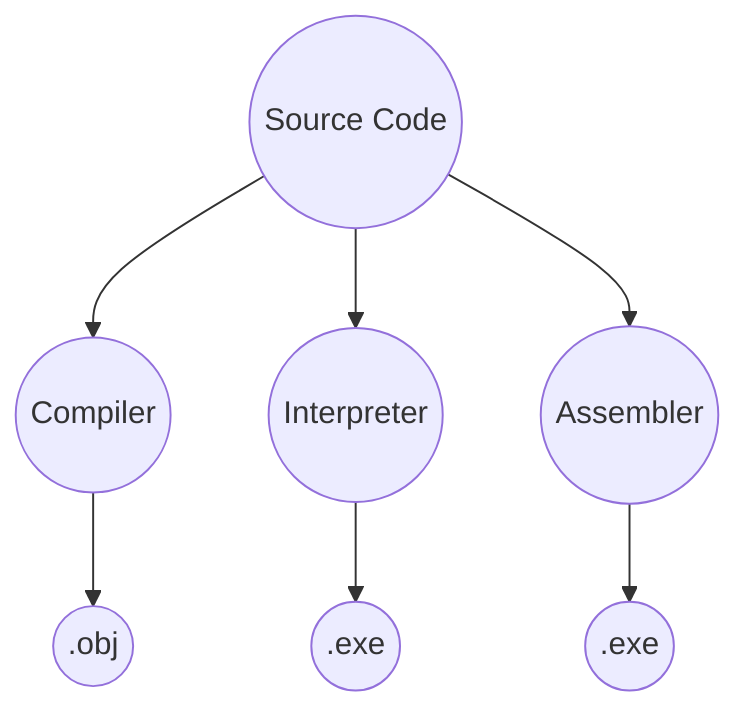
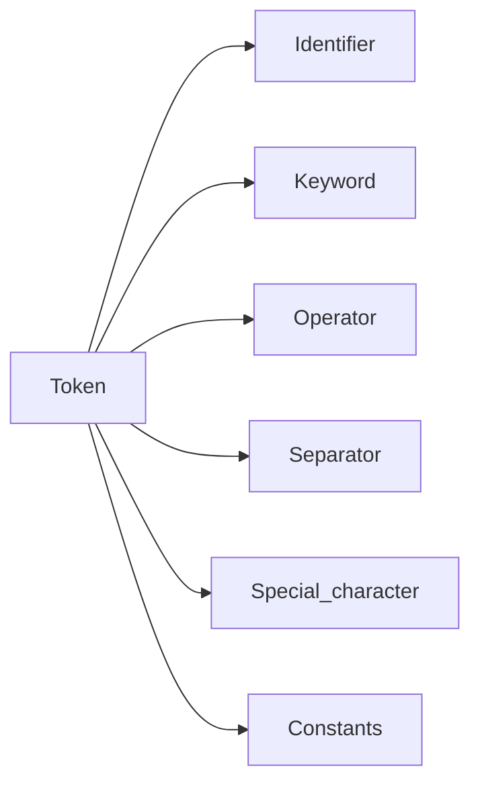
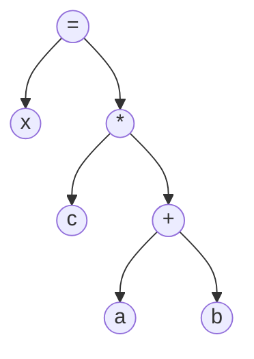
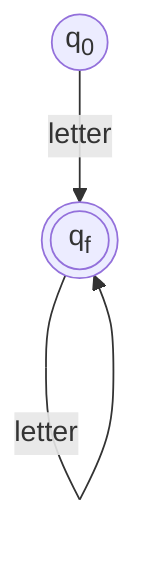
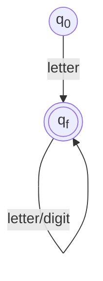
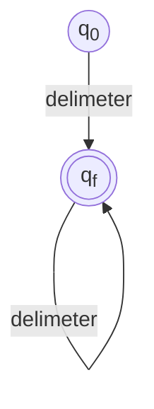

# Compiler Design

**Compiler:** It is a software which converts a program written in High Level Language to Machine Level Language aslo known as Object code. It is used to show syntax errors to the programmers. Its purpose is to convert the High Level code to Low Level code without changing the meaning of the program.

**Interpreter:** Purpose is similar to that of the compiler whereas the speciality of an interpreter is to read input state line by line and to construct intermediate code for each statement immediately. Whenever an interpreter encounters any error it stops execution and shows it to the user.

**Hybrid Compilers:** These language translators supports both Compilation and Interpretation. It translates the source code into intermediate byte code. e.g.: JIT Compiler.



## Difference between Compiler & Interpreter
|Compiler|Interpreter|
|---|---|
|Scans the whole program in one go|Scans one line of the program at a time|
|Doesn't require source code for later execution|Requires source code for later execution|
|Machine code is stored in the disk storage|Machine code is stored nowhere|
|Takes large amount of time to analyze the source code|Takes less amount of time to analyze the source code|
|CPU utilization is more|CPU Utilization is less|
|It is more efficient|It is less efficient|
|e.g.: C, C++, C# etc.|e.g.: Python, Ruby, Perl|

## Internal Architecture of a Language Translator
<center></center>

- **Preprocessor:** 
	- In this section the pre-processor files are attached in our code.
	- File like 'stdio.h', 'math.h' are attached with the C source code and the final code is generated
- **Compiler:** 
	- After generating the preprocessed source code it moves to the compiler and the compiler generates the assembly level code after compiling the whole program
- **Assembler:** 
	- This part takes the assembly level code from compiler and generates the .obj code. This code is quite similar to the machine code.
- **Linker/Loader:** 
	- Linker - It is an important part of the compilation process. It takes the object code and linked it with the other library files. These library files are not the part of our code but it helps to execute the total program.
	- Loader - It helps to load the code into the primary memory and helps to execute it. Executing the program is named as process.

## Compiler Internal Architecture
- **Lexical Analysis:** Generates stream of Tokens
- **Syntax Analysis:** Generates a parse tree
- **Semantic Analysis:** Generates a semantic parse tree
- **Intermediate Code Generation:** Generates Three Address Code based Intermediate code
- **Code Optimization:** Generates an optimized Intermediate Code
- **Target Code Generation:** Generates the corresponding Assembly Code

<center></center>

**Frontend:** It is machine independent 
**Backend:** It is machine dependent

_**Note: Lexical, Syntax and Semantic Analysis Phases are known as Analysis Phase & the rest 3 as Synthesis Phase**_

<center></center>

- **Lexical Analyzer:** The expression is given to the lexical analyzer which takes _lexemes_ as input and generates Tokens as output. 
	- It gives error messages like: Unmatched String, Illegal Character, Exceeding the length etc.
	- It eliminates comments, white spaces(tab, blank spaces and new line)
_**Lexemes** are similar to words with a small difference. Words entirely have their own meaning but group of lexemes in the entire expression convey the meaning. e.g.: x=a+b*c. Individually x has no meaning but when the entire expression is considered then there comes out a meaning._
`x=a+b*c;`

**Tokens:** These are the sequence of characters which represents a unit of information in the source program.

Syntax of token in Symbol Table is: <token_name,attribute_value>

**Symbol Table:** It is a data structure which stores identifier, size of identifier, scope etc.

Symbol Table example :
|Lexemes|Tokens|
|---|---|
|x|Identifier|
|=|Operator|
|a|Identifier|
|+|Operator|
|b|Identifier|
|\*|Operator|
|c|Identifier|

**Pattern:** It is a description which is used by the token. Incase of a keyword which use as a token, the pattern is a sequence of characters.



**Error Handler:** A module that displays the error to the user which occured in the analysis phase of the compiler.

-  **Syntax Analyzer:** Also known as the parser generates a Parse tree depending upon some Context-Free Grammar Production Rules. It takes the stream of tokens as inputs and gives the parse tree as output.

- **Semantic Analyzer:** It takes the parse tree generated by syntax analyzer as input and generates a Semantically Verified Parse Tree. It is responsible for Type checking, Array bound checking and correctness of scope resolution. It does the logical analysis of the parse tree.
<center></center>

- **Intermediate Code Generation:** It takes the Semantically Verified Parse tree as input and generates a intermediate code which is based on Three Address Code.
```
t0 = b * c;
t1 = a + t0;
x = t1;
```
- **Code Optimization:** It takes the intermediate code and generates an optimized code for the given intermediate code.
```
t0 = b * c;
x = a + t0;
```
- **Target Code Generation:** It takes the optimized code and generates its corresponding _Assembly Code_.

## Lexical Analyzer Architecture:

<center></center>

**Working of Lexical Analyzer:**
- At first, lexical analyzer creates a program _Lex.l_ in the Lex language
- The Lex compiler runs the *lex.l* program and produces a C program _lx.yy.c_
- C compiler runs the _lex.yy.c_ program and produces an object program _a.out_
- Finally _a.out_ is lexical analyzer that transform string into sequence of token.

**Lex Compiler:** It will transform the input pattern into a transition diagram and generates code in a C file called _Lex.yy.c_

**Lex File Format:**
A Lex program is separated into three sections by \%\% delimeters. The formal of Lex source is as follows:
```
{definition}
%%
{rules}
%%
{user subroutines}
```
**Definitions** include declarations of constant, variable and regular definitions.

**Rules** define the statement of form p1 {action1} p2 {action2}....pn {action}.
- Where **pi** describes the regular expression and **action1** describes the actions what action the lexical analyzer should take when pattern pi matches a lexeme.

**User subroutines** are auxiliary procedures needed by the actions. The subroutine can be loaded with the lexical analyzer and compiled separately.

# Assignment / Exercise:

1. Consider the following statement: `Dis = b * b - 4 * a * c`.
Apply the follwing phase for the above statement:
- Lexical Analyzer
- Syntax Analyzer
- Semantic Analyzer
- Intermediate Code
- Code Optimizer
- Code Generation

**Sol<sup>n</sup>:** 
1. `<id1,Dis> <op,=> <id2,b> <op,*> <id2,b> <op,-> <const,4> <op,*> <id3,a> <op,*> <id4,c>`
2. 
```mermaid
flowchart TD
= --> dis & -
- --> id1([*]) & id2([*])
id1([*]) --> id3((b)) & id4((b))
id2([*]) --> id6((4)) & id5((*))
id5((*)) --> a & c
```

4. 
```
t1 = id3 * id4
t2 = int to real(4)
t3 = t1 * t2
t4 = id2 * id2
t5 = t4 - t3
dis = t5
```
5. 
```
t1 = id3 * id4
t2 = t1 * int to real(4)
t3 = id2 * id2
dis = t3 - t2
```

6. 
```assembly
MOVF id3,R1
MOVF id4,R2
MULF R2,R1
MULF #4,R1
MOVF id2,R3
MULF R3,R3
SUBF R3,R1
MOVF R1,id1
```

## Finite Automata Terminologies
- **Symbol:** Entity or individual object
	- e.g.: a,b,c,...,z; A,B,C,...,Z; 0,1,2,...,9
- **Alphabet:** It is a finite set of symbols
	- e.g: It is denoted by $\sum$ = {a,b}
- **String:** It is a sequence or collection of alphabet
	- e.g: a, aa, aaa, aaaa,.....
- **Language:** All the possible combination. Its a collection of strings.
- **Automata:** It is the study of abstract machine and the computation problem that can be solved using this machine. The abstract machine is called automata. It consists of states and transitions. The state is represented as circles and the transition is represented as arrows.
	-  Finite - $\sum$ = {aa, ab, ba, bb}
		- It is used for Pattern Matching or recognizing pattern.
		- It has 2 states:
			- Accepted - When the input string is processed successfully and the automata reaches its final state, then it will be accepted state
			- Rejected
		- Q: Finite set of states
		- $\sum$: Finite set of input symbol
		- q<sub>0</sub>: Initial state
		- F: Final state
		- It is defined as: $\delta$ : Q X $\sum$ -> Q
		- It is of 2 types:
			- DFA (Deterministic Finite Automata)
				- In the transition diagram, with a particular input only one state changes, hence known as DFA
			- NDFA (Non-Deterministic Finite Automata)
	- Infinite - $\sum$ = { ab, abab, ababab,.....

## Token Recognition
**Recognizing Keyword:**


**Recognizing Identifiers:**


**Recognizing Delimeters:**


## Regex
### Pattern:

|Pattern|Meaning|
|---|---|
|\[abc\]|Only a,b,c|
|\[^abc\]|Anything except a,b,c|
|\[a-z\]|Anything between a to z|
|\[A-Z\]| Anything between A to Z|
|\[a-z A-Z\]|a to z, A to Z|
|\[0-9\]|0 to 9|

### Quantifiers:

|Quantifiers|Meaning|
|---|---|
|\[ \]?| Occurs 0 or 1 time|
|\[ \]+|Occurs 1 or more times|
|\[ \]\*|Occurs 0 or more times|
|\[ \]{n}|Occurs n times|
|\[ \]{n, }|Occurs n or more times|
|\[ \]{y,z}|Occurs atleast y times but less than z times|

### Metacharacters

|Metacharacters|Meaning|
|---|---|
|\\d|\[0-9\]|
|\\D|\[^0-9\]|
|\\w|\[a-z A-Z_0-9\]|
|\\W|\[^\w\]|

### Examples:
- Mobile number staring with 8 or 9 and total digits are 10
	- \[89\]\[0-9\]{9}
- First character is uppercase, contains lowercase alphabets, only one digit is allowed in between
	- \[A-Z\]\[a-z\]\*\[0-9\]\[a-z\]\*
- Email Id
	- \[a-zA-Z0-9_\-\.\]+\[@\]+\[a-z\]+\[\.\]+\[a-z\]

