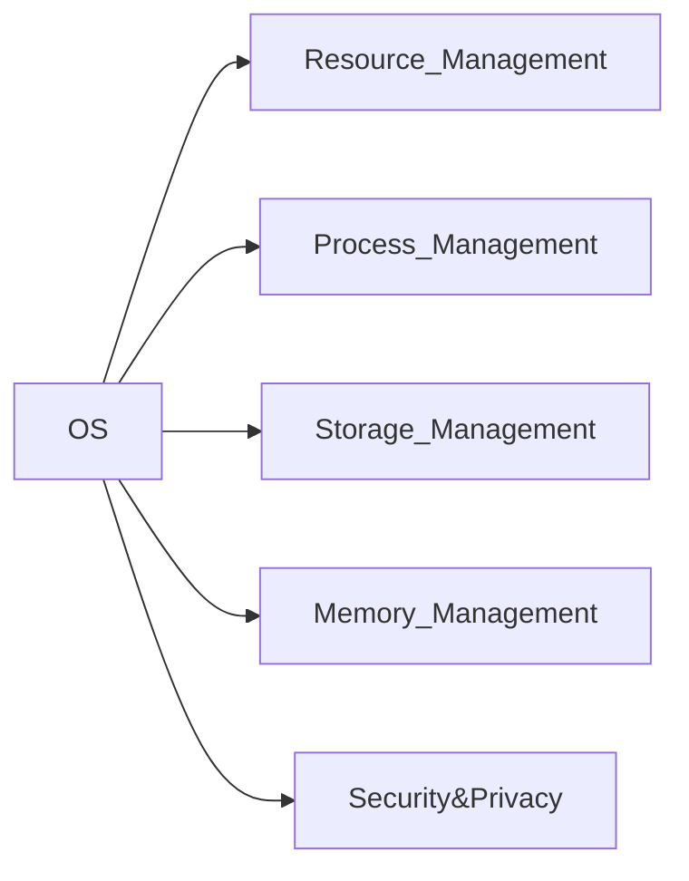
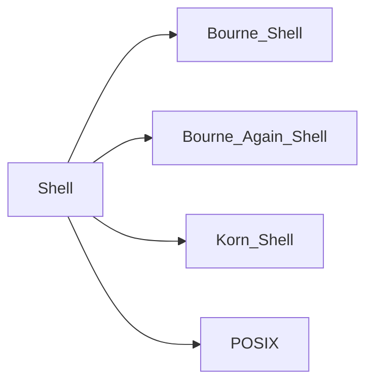
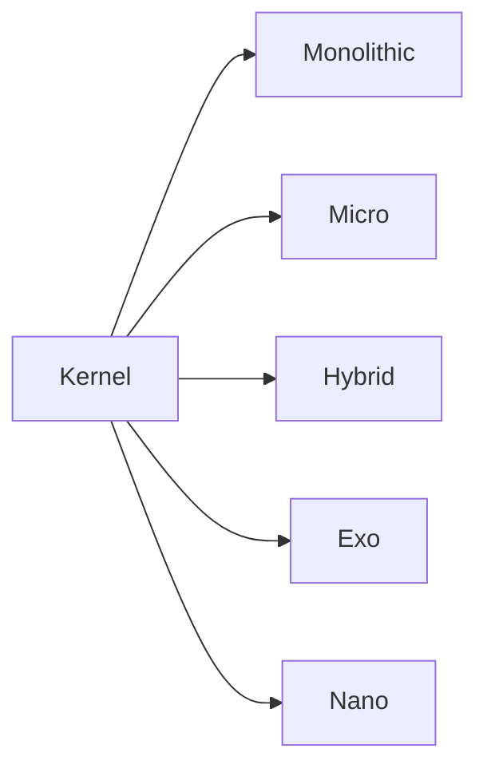
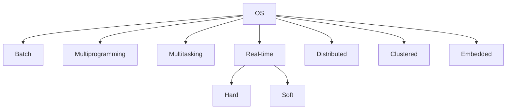
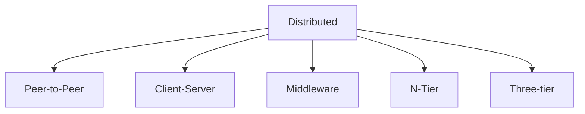
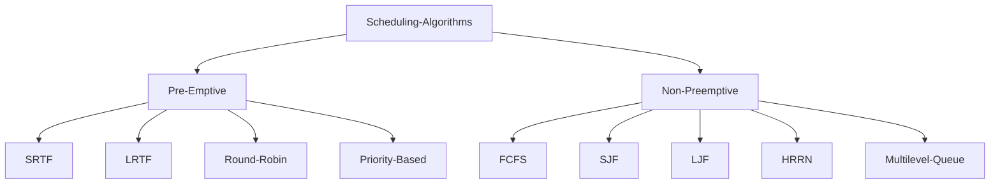

# Operating System
**What is an Operating System ?**
- An OS serves as an interface between the user and the hardware.
- It is a software that manages the computer hardware.
- e.g.: Windows, Mac, Linux

**What is the functions of OS ?**
- Provide convenience to the user
- Efficient use of computer resources
- Ability to evolve with the effective development.
- Throughput (No. of task executed per unit time)


## Functionalities

**What is Resource Management ?** :
 When multiple user uses the same computer, OS has to provide hardware resources to all. This is called Resource Management

**What is Process Management ?**:
When we are executing multiple processes, like playing games, listening music, streaming in Discord all at once, then OS needs to properly execute the processes. The above tasks are achieved through various CPU Scheduling Algorithms.

**What is Storage Management ?**: 
It is about how the OS stores data permanently in the secondary devices like HDD. It is done through File Systems like NIFS, CIFS etc.

**What is Memory Management ?** :
 It deals with primary memory i.e. RAM. Which processes to load into RAM, how much memory to allocate and deallocate to those processes

**What is Security & Privacy ?**:
When a user logs in using his/her password, the OS should keep the password file in an inaccessible location so that unauthenticated user could not have access to it.

## Conceptual Diagram of Computer System


**What is I/O ?:** Stands for Input/Output. It is a communication process between computer and outside world.

**What are I/O devices ?:** The devices that helps in establishing an IO communication. e.g.: Keyboard, Mouse etc.. 

**What is IO Traffic Controller ?:** The module that keeps track of the status of the IO 


## Kernel & Shell

**What is Kernel ?**: It is a central component of an OS that manages operations of computer & hardware. It basically manages the operations of memory & CPU Time.

**What is a Shell ?**: A computer program that processes commands and outputs the results entered by the user.

**What is Terminal ?**: It is a text-based interface which lets you to enter commands that the computer processes.

**What is a Console ?**: It is a physical device that allows you to interact with the computer

## Types of Shell

## Types of Kernel

**What is Monolithic Kernel ? :** It is one type of kernel where all OS service operates in kernel space. 
- **e.g.: Linux, UNIX**

**What is Micro Kernel ? :**  It is a type of kernel which has minimalistic approach. It has virtual memory & thread scheduling. It is more stable with less service in Kernel space as it puts rest of the service in user space. 
- **e.g.: Mach, Amigo OS**

**What is Hybrid Kernel ?:**  It is a combination of both Monolithic and Micro Kernel. It has  the speed & design of monolithic and modularity & stability of micro kernel. 
- **e.g.: Windows NT**

**What is Preemption ?**: the ability of the operating system to preempt (that is, stop or pause) a currently scheduled task in favor of a higher priority task.

**What is non-Preemption ?**: the inability of the operating system to preempt (that is, stop or pause) a currently scheduled task in favor of a higher priority task.

## Types of OS

**What is Batch OS:**  These OS's were non-interactive. That means that the user could not directly interact with the OS. The users used to prepare their job in a form of punch cards. In those punch cards there used to be certain number of holes. If light passes to that hole then its 1 and if hits the card surface then its 0. This is how the job we prepares and the user used to give their jobs to the Operator. The operator used to make batches of those punch cards based upon needs or natures and used to give it to the card reader. Then the card reader would read the card and the output were shown.


**What is Multiprogrammed OS ?:** In this type of OS, the CPU completely executes a process and then jumps to the next process. It is non-premptive in nature.

**What is Multitasking OS ?:** Also known as Time Sharing OS. In this OS, the CPU executes each process for a particular amount of time and it keeps on cycling until every process ends. It is premptive in nature.

**What is Real Time OS ?**: In real time OS, time is the main constraint. They are used when there are time requirements that are very strict like missile systems, air traffic control systems, robots, etc.
There are 2 types of Real Time OS:
1. ***Hard Real-Time***: These OSs are meant for applications where time delays are very strict and even a shortest possible delay is not acceptable. Like Automatic Parachutes/Airbags.
2. ***Soft Real-Time***: These OSs are for applications where time delays are less strict. Like PC, Audio Video Systems.

**What is Distributed OS ?**: In this types of OSs, there is a connection between many computers via a single communication channel that works in both directions. Every system in a distributed OS has its own memory, CPU and other hardware peripherals. Where each individual system is connected to a same network.

**Diagram of Distributed OS**


**What is Clustered OS ?**: In this OS, each individual computers having their own specific hardware peripherals are connected in a single network. E.g.: LAN

**What is Embedded OS?** An embedded operating system is a specialized operating system (OS) designed to perform a specific task for a device that is not a computer. E.g.: Smart TV, Smart Washing Machine, Microwaves etc.

## Process States
 ```mermaid
 flowchart LR
 id1((New)) --> |LTS| id2((Ready)) --> |STS| id3((Running)) --> id4((Terminated))
 id3((Running)) --> |IO Requests| id5((Wait/Block))
 id3((Running)) --> id2((Ready))
 id5((Wait/Block)) --> |IO Complete| id2((Ready))
 id5((Wait/Block)) --> |MTS| id6((Suspended Wait))
 id6((Suspended Wait)) --> id5((Wait/Block))
 id2((Ready)) --> |MTS| id7((Suspended Ready))
 id7((Suspended Ready)) --> id2((Ready))
 id6((Suspended Wait)) --> |Backing Store| id7((Suspended Ready))
 ```
**New:** The state where we created a process.
- Process is located at the Secondary Memory

**Ready:** The state where the process has been loaded
- Process is located at the Primary Memory
- Allocation of the process in the memory is being done
- The process is being loaded from New to Ready State by the ***Long Term Scheduler (LTS)***
- LTS brings all the processes from New state to Ready state by the technique called Multiprogramming.

**Running:** The state where the process is currently getting executed.
- Being an uniprocessor system, only one process is going from Ready Queue to the Running state.
- The processes is brought from Ready state to Running state by the ***Short Term Scheduler (STS)***

**Terminated:** The state where the process stops executing or finishes its execution.
- Deallocation of the process in the memory is being done.

**Wait/Block:** During execution of a process, if the process requests for an IO operation, then the process is sent to the Wait/Block state and meanwhile other processes are getting executed in the CPU.
- Once the IO Process is done, the process is not sent to the Running state as some other process is getting executed. The process is sent to the Ready state.
- The process is located at RAM

**From Running to Ready:** There could be 2 reasons:
- **Priority:** During execution of any process, if any high priority process pops in, the previous process is sent back to the Ready state and the VIP process starts executing.
- **Time Quantum:** If the time limit is set to a few seconds, then each process runs for those few seconds and are sent back to the Ready state until it gets completely executed.

**From Wait/Block to Suspended Wait:** When a process requests for an IO, it is being sent to the Wait Block. Now, if the Wait block gets filled, the process is sent to the Suspended Wait Block and it is done by ***Medium Term Scheduler***

**From Ready to Suspend Ready:** If the ready queue is full and some high priority process is trying to load, then few processes are sent to the Suspend Ready state and high priority process gets to load into the Ready State. 
- The above shifting is done by ***MTS***

**From Suspended Wait to Suspended Ready:** When a process finishes its IO Job and tries to get back to the Waiting state so to go to the Running state via Ready, if by-chance the Wait block is filled, it goes to the Suspended Ready and then goes to Ready and then to the Running State.

**What is Degree of Multiprogramming ?**: The number of process to be loaded into the Ready Queue which is being handled by the Long Term Scheduler.

**What is System Calls? :** System calls provide an interface to the services made available by an OS.
**Types of System Call:**
- File Related: Open, Read, Write
- Device Related: Read/Write of IO Device
- Information: getPid(), getSystem()
- Process Control: Execution & Creation
- Communication: pipe()

## Process Control Block
**Attributes of Process:**
1. Process ID
2. Program Counter
3. Process State
4. Priority
5. General Purpose Registers
6. List of Open Files
7. List of Open Devices
8. Protector

**What is Process Control Block:** It is a data structure that contains information of the process related to it.

**What is Context Switching ?:** Context Switching involves storing the context or state of a process so that it can be reloaded when required and execution can be resumed from the same point as earlier. This is a feature of a multitasking operating system and allows a single CPU to be shared by multiple processes.


**Summary:** 
- At first process P1 is getting executed and process P2 is in the ready queue.
- Now, P1 has got an interrupt, let's say IO. So CPU saves its state into PCB as PCB1 and brings P2 from the ready queue. 
- Meanwhile, P1 has completed its IO and is waiting in the Ready Queue
- Now, P2 too got IO operations, so CPU saves its states in the PCB as PCB2 and reloads the saved state of P1 from PCB1 and executes the leftover operations.

## CPU Scheduling Algorithms

**What is Scheduling Algorithm ?:** It is a way to select the process present in Ready queue and bring it to the CPU.

**Why do processes pre-empt ?**
1. Time Quantum - A fixed amount time during which a process will execute.
2. Priority - A high priority process appears during execution of a low priority process.

**CPU Scheduling Terms:**

- **Arrival Time**: The time at which process enter the Ready Queue or Ready State
- **Burst Time**: The time required by a process to get execute on CPU
- **Completion Time**: The time at which process complete its execution
- **Turn Around Time**: `Completion Time - Arrival Time` , the complete time taken to complete a process
- **Waiting Time**: `Turn Around Time - Burst Time`, time processes spend in the ready queue waiting their turn to get on the CPU.
- **Response Time**: `Time at which the process get CPU first time - Arrival Time`, the total elapsed time from when a request is made to the time it is completed.

***Link of Algos are mentioned:***
- [FCFS](https://www.studytonight.com/operating-system/first-come-first-serve)
- [SJF](https://www.studytonight.com/operating-system/shortest-job-first)
- [HRRN](https://www.studytonight.com/operating-system/highest-response-ratio-next-hrrn-scheduling)
- [SRTF](https://www.studytonight.com/operating-system/shortest-remaining-time-first-scheduling-algorithm)
- [LJF](https://www.studytonight.com/operating-system/longest-job-first-scheduling-algorithm)
- [LRTF](https://www.studytonight.com/operating-system/longest-remaining-time-first-scheduling-algorithm)
- [Round Robin](https://www.studytonight.com/operating-system/round-robin-scheduling)
- [Priority](https://www.studytonight.com/operating-system/priority-scheduling)
- [Multilevel Queue](https://www.studytonight.com/operating-system/multilevel-queue-scheduling)

